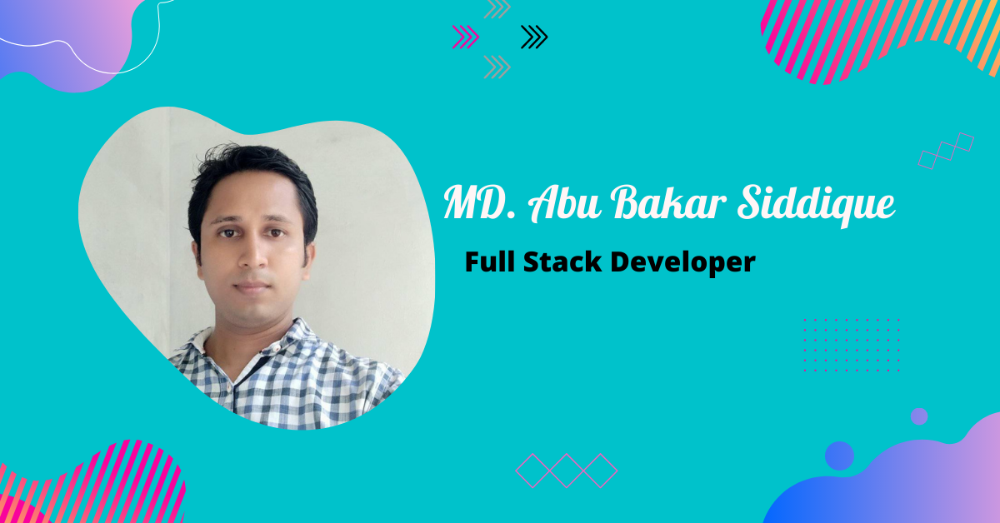

### Hi there 👋

<!--
**Niaz963/Niaz963** is a ✨ _special_ ✨ repository because its `README.md` (this file) appears on your GitHub profile.

Here are some ideas to get you started:

- 🔭 I’m currently working on ...
- 🌱 I’m currently learning ...
- 👯 I’m looking to collaborate on ...
- 🤔 I’m looking for help with ...
- 💬 Ask me about ...
- 📫 How to reach me: ...
- 😄 Pronouns: ...
- ⚡ Fun fact: ...
-->

<!-- banner image starts here  -->

<!-- banner image ends here  -->

<h1> 👋 Hello, I'm MD. Abu Bakar Siddique </h1>

A full time Web design & Web developer  
🏠 &nbsp; Living: Dhaka, Bangladesh

<!-- Contact me section starts here  -->

[][website]
[][youtube]
[][facebook]
[][linkedin]
 
 

<!-- Contact me section ends here  -->

<!-- about-me section starts here  -->

### 👨‍🏫 &nbsp; About Me

  I am Md. Abu Bakar Siddique,Have completed B.Sc in Electronics and Communication Engineering(ECE) from Institute of Science & Technology(IST),Under National         University.I have experience on Web design & Web development. After completing my  B.Sc Engineering, I am spending much time
  improving my web development skills. Every day I want to learn something new and share my knowledge with
  my teachers and others.

 
<!-- about-me section ends here  -->

<!-- web related skills section starts here  -->

### 👨🏽‍💻 &nbsp; My Skills & Videos:

#### Key Skills & Videos on Web development:

 
 
 

<!-- web related skills section ends here  -->
<!-- other skills and my videos for computer science section starts here  -->

#### Other Skills & Videos:

 
 
 

- [Artificial Intelligence (English)][aienglishplaylist]
- [Artificial Intelligence (Bangla)][aibanglaplaylist]
- [Java Swing][javaswingplaylist]
- [Discrte Math][dsplaylist]
- [Numerical Method][numericalplaylist]
- [Theory of computation][tocplaylist]
- [Compiler][compilerplaylist]
- [Networking][networkingplaylist]
- [Operating System][operatingsystemplaylist]
- [HSC ICT][hscictplaylist]
- [Learn for skill][learnforskillplaylist]
- [MS Word][mswordplaylist]
- [MS Excel][msexcelplaylist]
- [MS powerpoint][mspowerpointplaylist]
  <!-- other skills and my videos for computer science section ends here  -->

   

<!-- github stats starts here  -->

<!--  -->

 

<!-- github stats ends here  -->
  <!-- latest youtube videos starts here -->

#### 📹 &nbsp; My Latest YouTube Videos

<!-- YOUTUBE:START -->
- [Full-stack web 2022 Quiz-3 Bootstrap Winner&#39;s video from India](https://www.youtube.com/watch?v=kHKLLnJT680)
- [React Bangla Tutorial 27 : how to create FAQ section for website](https://www.youtube.com/watch?v=_FqhFjO1KY0)
- [React Bangla Tutorial 26 : how to do toggle](https://www.youtube.com/watch?v=HyJlYJBsqvE)
- [React Bangla Tutorial 36 : React Hooks | useRef Hook](https://www.youtube.com/watch?v=l5z137GWakU)
- [React Bangla Tutorial 35 : ref in a class component with example](https://www.youtube.com/watch?v=EyUsClvwmeo)
<!-- YOUTUBE:END -->

↪️ &nbsp; [search more videos...](https://www.youtube.com/c/anisulislamrubel)

 

<!-- latest youtube videos ends here -->

<!-- other skills and my videos for computer science section starts here  -->

<!-- work experience section starts here  -->

### 💼 &nbsp; Employment History

| Position            | Institute                                   | Duration            | Location           |
| ------------------- | ------------------------------------------- | ------------------- | ------------------ |
| Courier (Part-time) | Posti Oy                                    | Oct 2019- Running   | Tampere, Finland   |
| Research Assistant  | Tampere University                          | Nov 2020 - Jan 2021 | Tampere, Finland   |
| Lecturer of ICT     | Jaflong Valley Boarding School              | Jul 2018 – Nov 2018 | Sylhet, Bangladesh |
| Guest Lecturer      | Sylhet Engineering College                  | Nov 2017 – Apr 2018 | Sylhet, Bangladesh |
| Android developer   | United Computer & Technical Training Center | Nov 2016 – Nov 2017 | Sylhet, Bangladesh |
| Lecturer of ICT     | Zhingabari High School & College            | May 2016 – Aug 2017 | Sylhet, Bangladesh |

 
<!-- work experience section ends here  -->
<!-- education section starts here  -->

### 👨🏻‍🎓 &nbsp; Education

1. M.Sc. in Software, Web & Cloud  
   Tampere University  
   Tampere, Finland.
2. B.Sc. in Computer Science & Engineering  
   Leading University  
   Sylhet, Bangladesh.
3. Professional Diploma in Travel & Tourism  
    London School of Commerce & IT  
   London, England.

 

<!-- education section ends here  -->

<!-- my languages section starts here  -->

### Languages:

- 🇧🇩 Bangla : Native
- 🏴󠁧󠁢󠁥󠁮󠁧󠁿 English : Advanced
- 🇮🇳 Hindi : Intermediate
- 🇧🇷 Portugues : Basic
   

<!-- my languages section ends here  -->

<!-- my sports and game section starts here  -->

### Sports / Game / Activities / Hobby:

- 🏏 Cricket, ⚽ Football, 🏸 Badminton, ♟️ Chess, 🏐 Volleyball
- 🏊‍♂️ Swimming, 🏃‍♂️ Running, 🚶‍♂️ Walking
- ✈️ Travelling

 
<!-- my sports and games section ends here  -->

<!-- Honors & awards section starts here  -->

### 🏅 Honors & Awards :

- Silver Button from YouTube (295k subscribers currently)
- Pubali Bank Scholarship of 40,000 BDT for outstanding result in B.Sc.

---

Thanks for going through my Portfolio.
All rights reserved by Anisul Islam @2021

---

<!-- my achievement section ends here  -->

<!-- Links section starts here -->

[website]: http://www.studywithanis.com/
[youtube]: https://www.youtube.com/c/anisulislamrubel
[facebook]: https://www.facebook.com/arif.islam.7921975/
[linkedin]: https://www.linkedin.com/in/anisul2020/
[github]: https://github.com/anisul-Islam

<!-- cse related playlists starts here  -->

[cplaylist]: https://youtube.com/playlist?list=PLgH5QX0i9K3pCMBZcul1fta6UivHDbXvz
[cplusplaylist]: https://youtube.com/playlist?list=PLgH5QX0i9K3q0ZKeXtF--CZ0PdH1sSbYL
[aienglishplaylist]: https://www.youtube.com/playlist?list=PLgH5QX0i9K3rRVV7oeML93OVAxqQ-CvzV
[aibanglaplaylist]: https://youtube.com/playlist?list=PLgH5QX0i9K3oFAaeJxjDWA8kEbMutzV6V
[javaswingplaylist]: https://www.youtube.com/playlist?list=PLgH5QX0i9K3rAHKr6IteF5kdgN6BorH9l
[numericalplaylist]: https://youtube.com/playlist?list=PLgH5QX0i9K3oKFrSOo4Kwns1-vTZmKQ7z
[operatingsystemplaylist]: https://youtube.com/playlist?list=PLgH5QX0i9K3r_SuT0AnOEoElfQQPgkBIq
[dsplaylist]: https://youtube.com/playlist?list=PLgH5QX0i9K3rYy9DVhk28m8enSo8xxiZ3
[tocplaylist]: https://youtube.com/playlist?list=PLgH5QX0i9K3qw5pu16QgnKNj91Rnjoyd0
[compilerplaylist]: https://youtube.com/playlist?list=PLgH5QX0i9K3oWTwTgILA7v9oysoDgkJDg
[networkingplaylist]: https://www.youtube.com/playlist?list=PLgH5QX0i9K3p5OI88r3ob-otmKqIm_DbS
[hscictplaylist]: https://www.youtube.com/playlist?list=PLgH5QX0i9K3o8Y-CKhmyodbfHAc9VSVOv
[learnforskillplaylist]: https://youtube.com/playlist?list=PLgH5QX0i9K3qyJVIaeHSqiRWOyO6HW023
[mswordplaylist]: https://www.youtube.com/playlist?list=PLgH5QX0i9K3p21lsneT3cW4CJL4Bd1lJ2
[mspowerpointplaylist]: https://youtube.com/playlist?list=PLgH5QX0i9K3pBnrckqfJ2zn7FL6Q_LNcm
[msexcelplaylist]: https://www.youtube.com/playlist?list=PLgH5QX0i9K3ohKCQMR7aopneByGX05iSK

<!-- cse related playlists ends here  -->

<!-- Links section ends here -->

